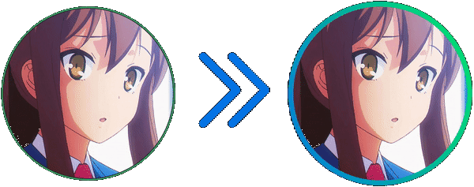

# Animated Speaking Rings
A theme for BetterDiscord that adds animated rings around people speaking.

[![BD](https://img.shields.io/badge/Better%20Discord-1c2159?style=for-the-badge&logo=data:image/png;base64,iVBORw0KGgoAAAANSUhEUgAAAIwAAACMAgMAAADTrqmtAAAABGdBTUEAALGPC/xhBQAAAAFzUkdCAK7OHOkAAAAJUExURTqC5Wp4kP///6XJ6B8AAAADdFJOU/wI/U19SsMAAAB7dEVYdFJhdyBwcm9maWxlIHR5cGUgaXB0YwAKaXB0YwogICAgICA0MgozODQyNDk0ZDA0MDQwMDAwMDAwMDAwMWQxYzAyMzcwMDA4MzIzMDMyMzEzMDM2MzEzNzFjMDIzYzAwMGIzMTM2MzEzODMyMzcKMmQzMTM2MzEzODAwCvG54j8AAAAJcEhZcwAALiMAAC4jAXilP3YAAAIdSURBVFjD7di9bsMgEAdwkOq9C+/jpTuRuA7Zu+R9WLJbinnKxgZcH8fByemHKsWj9c+Pwx+Es4L+oZ6ZTmZUu+Mlnr1eP1BG4WNYzl5CCJ5zluN+9j3sQ8RRSicoNJxluPOSufHOMto6WJh4Z4HWTGg4OhWUyq46ysSCwsw798FiQcHwjsoFTbyjckFzwxlSQaHhbBnPOzoXPfGOypmZd+5XKGwFcY5JEwsNZ8gZzzs6Zybe0XnyU8s5bxPjHJUzN97ZLlBoOGaf2b0ysPvBlvFfjgYc2i60Lx1wJDMRB74u9C6DnW2woeFYgePKzEydaqZwQOBA+QD9Ryccc5zAcQLHChxbvswz//yYhqP6jlV9h6ya2HGnt1e6+mLHVlff/T1VOKOR46qORg4InDRY4QzYsTVnwI6rOQY7UHMAO7EgTTLIsdTRpQPUGUonDkYy2LHE0cRx/XmtBXXmFQsi17BwbO9+pYKa9ysW1H5+0mDN5ycO1negdBR1YGy+F7kg8g4Sx2nyLhMHRrImEAdOZG2hjiNrFHWArHXUgda6ymZ4BwQO/KUz/5zjfjFT3ZMUxyjIVPdR9XJambG6r6tWXN/7sXtI/9heNO9pw2N7Y5w5vleX7PkNyhzvQQS9jKQn0oLeygh6NNPv9bSgZ9x6T/9QD6tT452a6sM9taA3N3kowbcCz34r0P1vDuv/z7n17SL9Q11m//xG9K2ZTyFz2kAzsWdgAAAAAElFTkSuQmCC)](https://betterdiscord.app/)
---

---
# click for a live preview
 
---
# How to use the spinning music bot function
using a plugin like [EditUsers](https://github.com/mwittrien/BetterDiscordAddons/tree/master/Plugins/EditUsers) by DevilBro:
1. Grab whatever image you want to use (I use a picture of a record)
2. Change the file name to mbotdisc
3. Change the music bot's profile picture to this file
4. Now you will have a spinning disc as your music plays!
---
## Custom CSS ##
<pre>
@import url('https://p0rtl6.github.io/BD-AnimatedSpeakingRings/src/base.css'); /* The base speaking rings */
@import url('https://p0rtl6.github.io/BD-AnimatedSpeakingRings/src/voiceconnectedpanel.css'); /* The voice connected panel */
@import url('https://p0rtl6.github.io/BD-AnimatedSpeakingRings/src/bigusers.css'); /* The fullscreen user panels */
:root{
  --gradient1:  #0575E6;
  --gradient2:  #00F260;
  --gradientangle: 45deg;
  --dmvoicebgcolor: #18191c
}
</pre>
